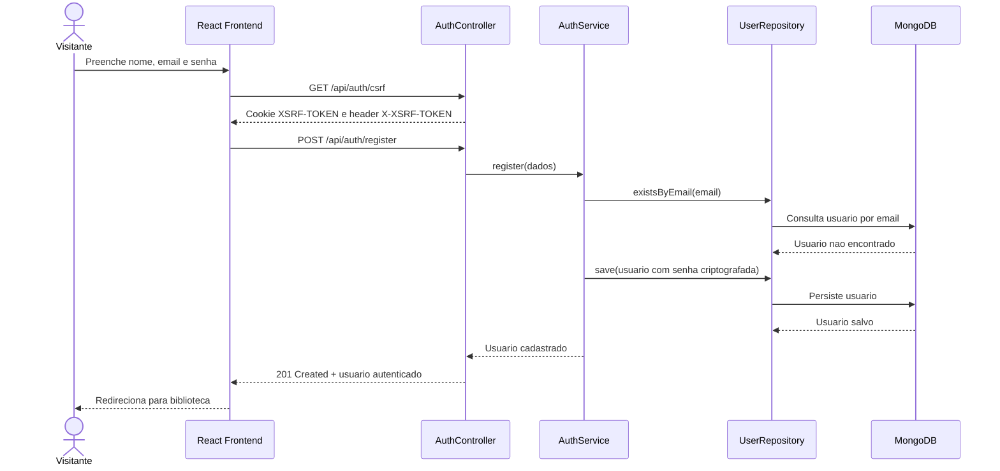
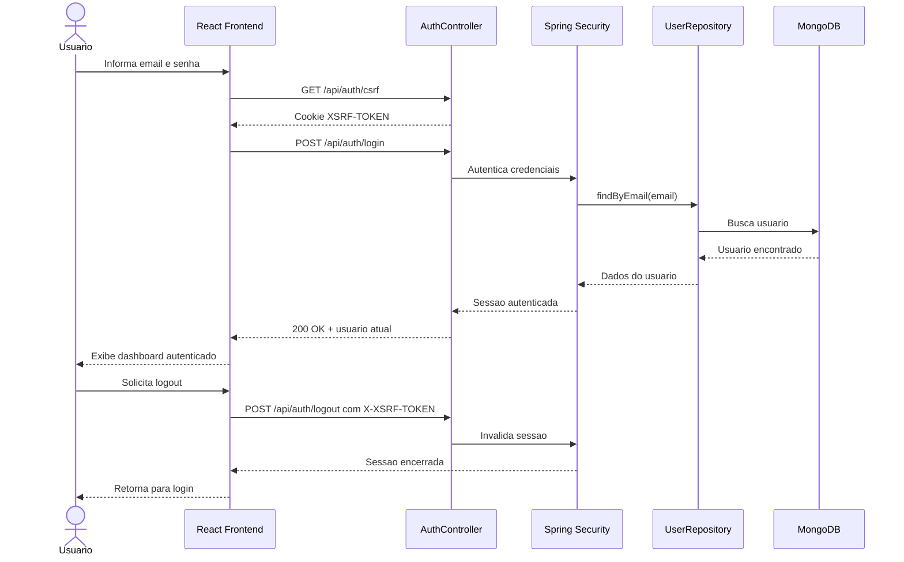
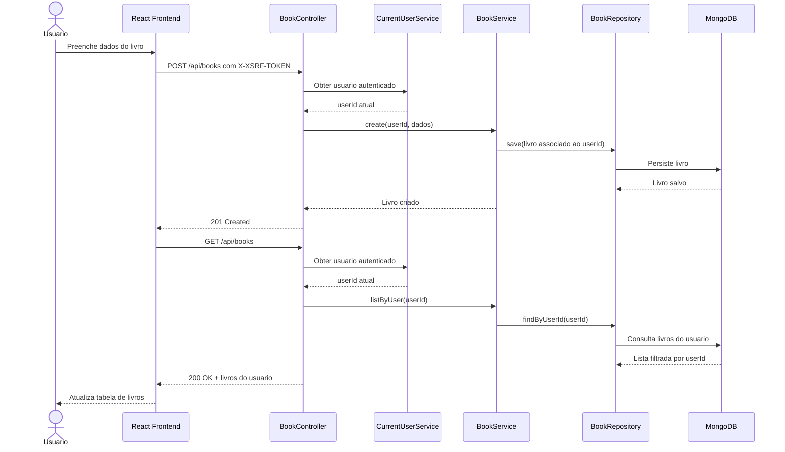
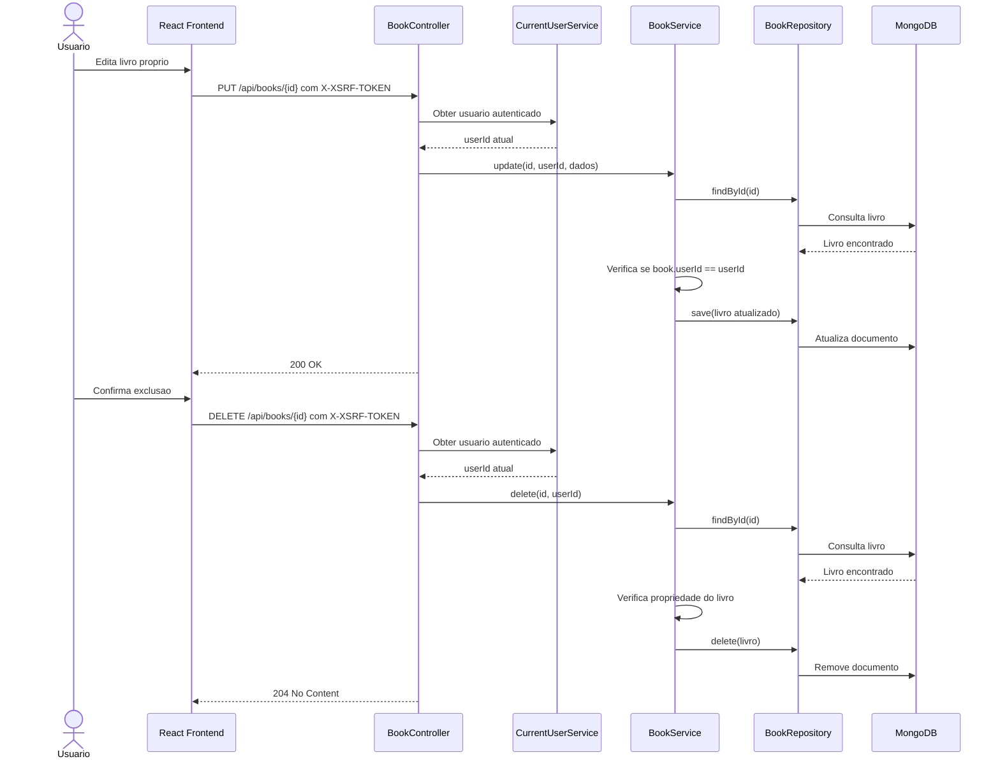
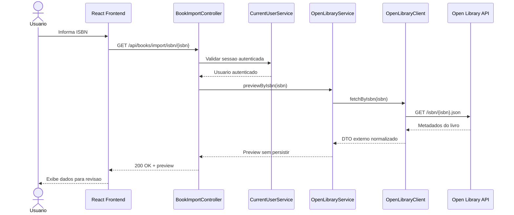
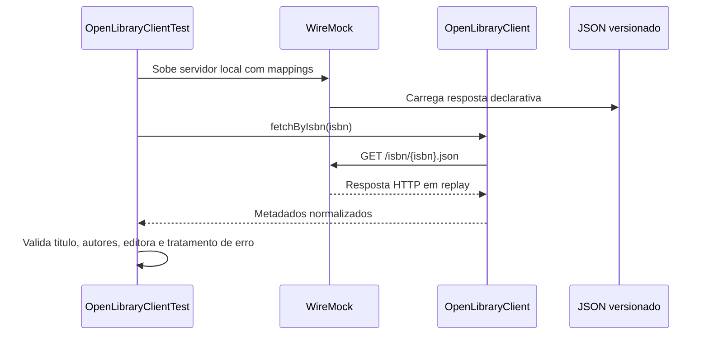
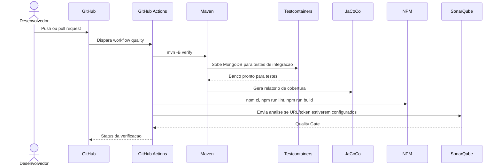

# Diagramas UML De Sequencia

## Objetivo

Este documento registra os diagramas UML de sequencia dos fluxos principais do Gerenciador de Biblioteca Pessoal. Eles complementam os casos de uso, a RTM e os casos de teste, mostrando a ordem das interacoes entre usuario, frontend, backend, servicos, banco MongoDB e Open Library API.

Na prova oral, estes diagramas devem ser usados para explicar como cada requisito sai da acao do usuario, passa pelas camadas da aplicacao e termina em uma resposta verificavel.

## UC-01 - Cadastro De Usuario

Requisitos: RF-01, RF-03

Como explicar: o cadastro valida dados, verifica duplicidade de email, salva o usuario no MongoDB e cria uma experiencia autenticada para o uso da biblioteca.

## UC-02 E UC-03 - Login, Sessao E Logout

Requisitos: RF-02, RF-03

Como explicar: a autenticacao usa Spring Security com sessao/cookie. O CSRF protege chamadas inseguras, e o logout invalida a sessao.

## UC-04 E UC-05 - Criar E Listar Livros

Requisitos: RF-04, RF-05, RF-08

Como explicar: todo livro e associado ao usuario autenticado. A listagem consulta por `userId`, o que implementa a restricao de acesso por usuario.

## UC-06 E UC-07 - Atualizar E Excluir Livros

Requisitos: RF-06, RF-07, RF-08

Como explicar: antes de atualizar ou excluir, o backend confirma que o livro pertence ao usuario autenticado. Essa regra evita acesso indevido entre usuarios.

## UC-08 - Pre-Visualizar Metadados Por ISBN

Requisitos: RF-09, RF-04, RF-08

Como explicar: a Open Library e usada apenas para pre-visualizar dados. O livro nao e salvo automaticamente; o usuario revisa e decide criar pelo fluxo normal de cadastro.

## VCR/WireMock No Teste Da Open Library

Requisitos: RF-09, RT-02

Como explicar: no CI normal, o teste nao chama a internet. WireMock representa o VCR em Java, reproduzindo uma resposta HTTP controlada e versionada.

## Pipeline De Qualidade

Requisitos: RNF-05, RNF-06, RNF-07

Como explicar: a pipeline automatiza verificacao de backend, frontend, cobertura e qualidade. Quando o SonarQube esta local, as evidencias ficam registradas nos prints; quando estiver acessivel ao runner, a mesma pipeline envia a analise.

